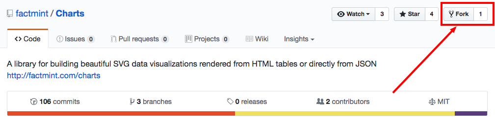
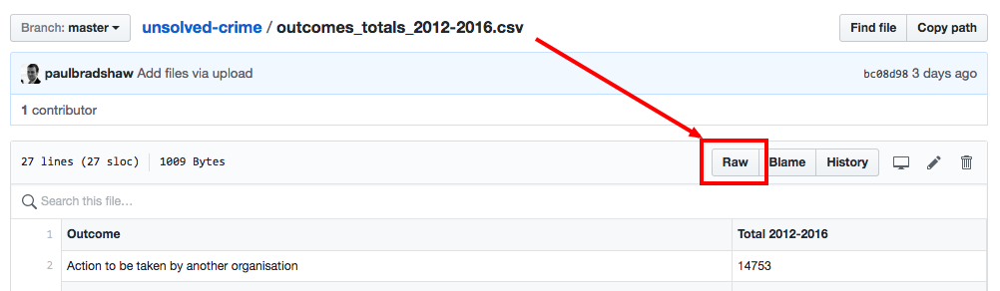
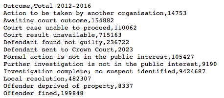
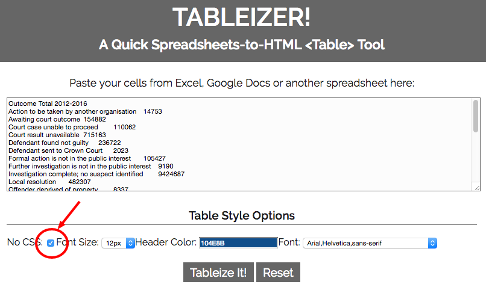
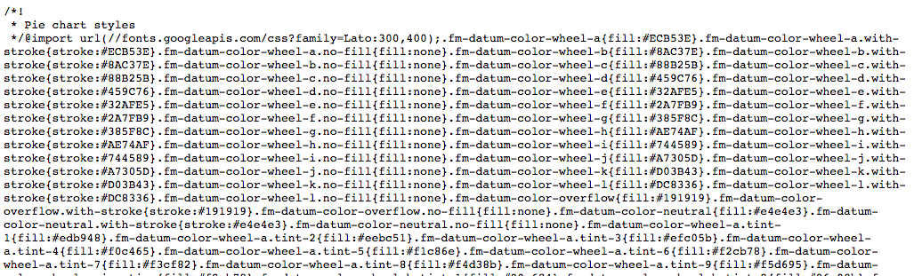
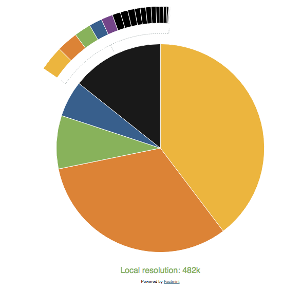
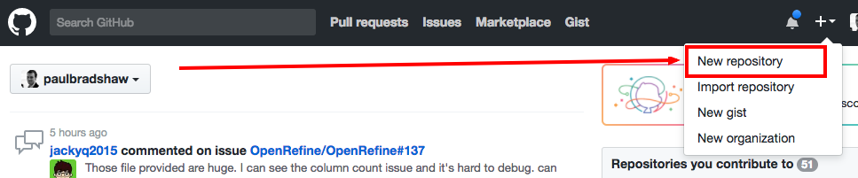
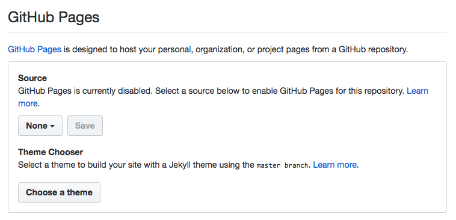
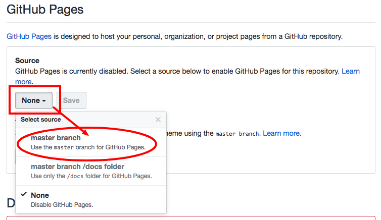
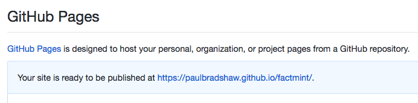

# Turning tables into charts

Interactive tables are useful - but at some point you're going to want to turn your table into an interactive chart. One of the easiest ways to do that is a visualisation library called **Factmint**.

Factmint is used by The Telegraph, among other organisations, because it requires very little coding knowledge at all - all you need is:

* A HTML page containing a table and links to...
* A CSS file, and
* A JS file

But for our purposes, it's a particularly useful library to get to know some techniques around using GitHub, and storing stylesheets and JavaScript.

## Finding the Factmint library

Factmint used to have a whole section on [its website](http://factmint.com/) where you could play with charts and generate code. However, the business has since changed its business model, and [its Charts section](http://factmint.com/charts/) will tell you that it has "open-sourced" Factmint Charts and moved it to GitHub. "Please feel free to download the code and host for your own purposes."

The GitHub page where Factmint Charts is now hosted is [https://github.com/factmint/Charts](https://github.com/factmint/Charts). It includes a page of documentation which might be a little intimidating: for example, the first step is "Download: `bower install factmint-charts` or manually download raw CSS and JS from the dist folder".

Don't worry - we'll do it our own way which isn't so bogged down in jargon.

## Forking the Factmint repo

That said, we *do* need to learn a little jargon along the way. The first bit of jargon is **forking**.

In GitHub - like Codepen - forking is the process of making a *copy* of a project. In some cases you might fork a project in order to experiment with some changes, and then if you're happy with those changes, merge them back into the original project (using what is called a **pull request**). You can fork your own projects, or you can fork others.

Some people use forking as a way to collaborate - for example if a web developer thinks they can improve someone's code, they might fork it and then make a pull request to the original developer. If the original developer likes the changes, they can approve the pull request and the changes become reflected in the original.

Of course we're nowhere near that situation. In this case, we're just creating a backup in case Factmint removes or changes their folder.

To fork the Factmint Charts repo make sure you are on [https://github.com/factmint/Charts](https://github.com/factmint/Charts) and logged into GitHub. Then click the **Fork** button (it should be in the upper right corner).



GitHub will get to work making a copy, and when it is finished, you should be taken to your own fork of the repo in your account - you can tell because it will be your username in the upper left corner, followed by **/Charts**, not Factmint.

Now you have a copy, we can start using it.

## Create a HTML table

Factmint takes a HTML table and turns it into a chart. This is great for accessibility because if the user has JavaScript or CSS turned off, they can still read the data.

One of the quickest ways to create a HTML table is to use the online tool [Tableizer](http://tableizer.journalistopia.com/): this allows you to copy a table from a spreadsheet, paste it in the box, and generate the HTML for a table containing that data. It does add some styling - but we can remove that.

We're going to use some data from a [BBC story on unsolved crime](http://www.bbc.co.uk/news/uk-england-40131277), because it gives us a change to explore GitHub further. That story [has its own GitHub repo](https://github.com/BBC-Data-Unit/unsolved-crime), and within that repo is [some data we can use for a pie chart](https://github.com/BBC-Data-Unit/unsolved-crime/blob/master/outcomes_totals_2012-2016.csv). Because it's in CSV format, GitHub actually displays the data in a nice readable HTML table. Now you could just copy and paste that data, but that's a bit fiddly. And you could fork or clone the repo - but we only want the one file, not all of the files in this repo.

The best option is to download the **raw** file. To do this, click on the **Raw** button just above the table.



This will open the *actual* CSV file in your browser.



You can now save it (CTRL+S or *File > Save page as...*) and open it on your computer.

Once it's open, copy all the data (including the column headings) and open [Tableizer](http://tableizer.journalistopia.com/). Paste your data in the box, tick the box marked *No CSS* (we don't need CSS) and click *Tableize It!*.



You should now have a box containing HTML code for a table which you can copy by clicking *Copy HTML to Clipboard*

Now, use a text editor like Atom to create a new HTML page - call it index.html.

You'll need the usual skeleton HTML, `<head>` and `<body>` tags like so:

```html
<!DOCTYPE html>
<html lang="en">
    <head>
    </head>
    <body>
    </body>
</html>
```

Then, somewhere inside the `<body>` tags, paste your table HTML. It should look something like this:

```html
<table class="tableizer-table">
<thead><tr class="tableizer-firstrow"><th>Outcome</th><th>Total 2012-2016</th></tr></thead><tbody>
 <tr><td>Action to be taken by another organisation</td><td>14753</td></tr>
 <tr><td>Awaiting court outcome</td><td>154882</td></tr>
 <tr><td>Court case unable to proceed</td><td>110062</td></tr>
 <tr><td>Court result unavailable</td><td>715163</td></tr>
 <tr><td>Defendant found not guilty</td><td>236722</td></tr>
 <tr><td>Defendant sent to Crown Court</td><td>2023</td></tr>
 <tr><td>Formal action is not in the public interest</td><td>105427</td></tr>
 <tr><td>Further investigation is not in the public interest</td><td>9190</td></tr>
 <tr><td>Investigation complete; no suspect identified</td><td>9424687</td></tr>
 <tr><td>Local resolution</td><td>482307</td></tr>
 <tr><td>Offender deprived of property</td><td>8337</td></tr>
 <tr><td>Offender fined</td><td>199848</td></tr>
 <tr><td>Offender given a caution</td><td>611237</td></tr>
 <tr><td>Offender given a drugs possession warning</td><td>215169</td></tr>
 <tr><td>Offender given absolute discharge</td><td>6354</td></tr>
 <tr><td>Offender given community sentence</td><td>336746</td></tr>
 <tr><td>Offender given conditional discharge</td><td>158314</td></tr>
 <tr><td>Offender given penalty notice</td><td>158807</td></tr>
 <tr><td>Offender given suspended prison sentence</td><td>140058</td></tr>
 <tr><td>Offender ordered to pay compensation</td><td>22797</td></tr>
 <tr><td>Offender otherwise dealt with</td><td>47376</td></tr>
 <tr><td>Offender sent to prison</td><td>372758</td></tr>
 <tr><td>Suspect charged as part of another case</td><td>93087</td></tr>
 <tr><td>Unable to prosecute suspect</td><td>1649291</td></tr>
 <tr><td>Under investigation</td><td>2427381</td></tr>
 <tr><td>(blank)</td><td>11640944</td></tr>
</tbody></table>
```

Now we have our HTML page with a table of data. Before we add the JS magic we need two other files in the same place.

## Bringing in the CSS and JS files

Time to go back to the [Factmint Charts repo](https://github.com/factmint/Charts) (or your personal fork of it) and that first line under *Getting started*:

> "Download: `bower install factmint-charts` or manually download raw CSS and JS from [the dist folder](https://github.com/factmint/Charts/tree/master/dist)"

The first bit - about `bower install factmint-charts` - refers to *command line*. We're not going to use that, so don't worry about it. Instead we're going to follow the 'or' option to "manually download raw CSS and JS from [the dist folder](https://github.com/factmint/Charts/tree/master/dist)"

[The folder at that link](https://github.com/factmint/Charts/tree/master/dist) - which is in the same repo - contains dozens of files with names like *scatter-options.txt* and *column-bar.min.css* and *doughnut.min.js*. You'll notice that these are the names of types of charts: scatter charts, column bar charts, doughnut charts, and so on. For each chart there are three files: a text file with 'options' for that chart; a CSS file; and a JS file.

Because we're going to create a pie chart, we need to manually download the files *pie.min.css* and *pie.min.js*

As with the CSV file, if you click on [the link to pie.min.css](https://github.com/factmint/Charts/blob/master/dist/pie.min.css) you will see a preview of the code in it - but to download it you must click again on the *Raw* button to see [the raw file](https://raw.githubusercontent.com/factmint/Charts/master/dist/pie.min.css).



Do this - download the raw version of the file. And then repeat the process for [pie.min.js](https://raw.githubusercontent.com/factmint/Charts/master/dist/pie.min.js) - again, remembering to click on the Raw button.

Once downloaded, put these two files - the Factmint CSS and JS files for a pie chart - in the same folder as the HTML file that you created.

## Linking the HTML file to the CSS and JS files

Now that we have all three files in the same place, we can start to add a few lines to the HTML so that it knows where to look. There are only three things we need to change, or add:

* The `class` attribute of the `<table>` tag needs to specify the chart we want
* A link to the CSS file for that chart needs to be added
* A link to the JS file for that chart needs to be added

At the moment the `<table>` tag already has a `class="tableizer-table"` attribute. So the first thing is to change that to:

```html
<table class="fm-pie">
```

Next, after the table we can add two links: one to the CSS file and another to the JS file. Because both are in the same folder we only need to give the file name (if they were elsewhere we'd have to describe a file path including folder names, etc.):

```html
<link rel="stylesheet" href="pie.min.css">
<script async src="pie.min.js"></script>
```

That's it! Here's the HTML in full including the table and those new tags:


Once you've saved the file, open it in a browser to test that it's working.

You might notice something quite cool about the Factmint pie chart: if you have lots of rows, like our data does, it does not create lots of tiny slices - which is bad pie chart design. Instead it shows the four biggest slices and then aggregates the rest into an 'other' slice - but you can click on that 'other' slice to see a further breakdown pop out. And you can hover over those slices to see what they are.



## Uploading to GitHub Pages

Now we've got it working locally (on our own computer), it's time to upload the same files to GitHub to create a live working webpage that anyone can see.

To do this, first create a new GitHub repository by clicking on the plus icon in the upper right and selecting *New repository*.



A new page will appear where you can give the repo a name, a description, and choose whether to *Initialize this repository with a README*. Tick that box to create a README file - this will make the next steps easier.

Once you click *Create repository* you will be taken to the new repository. It will have just one file: README.md. Ignore this for now.

There are three main ways of creating a webpage on GitHub: you can create a *folder* called 'docs'; you can create a *branch* called 'gh-pages'; or you can use the main 'master' branch of the repository.

Now you need to upload your three files (HTML, CSS and JS) to the repository. You can do this by clicking and dragging from a folder on your computer onto the repository page. It will take a moment to upload them, and then you will be shown a list underneath the option to upload more files. But the files aren't uploaded to your repo yet! There's one more step - make sure you click the green button at the bottom of the page to *Commit changes*. This confirms that you want to upload these files to this repo.

After the files have been processed you should now be back in the repo with four files: the three you have just uploaded, plus README.md. You're now ready to launch GitHub Pages for this repo.

Click on *Settings* - it's one of the tabs across the top of the repo, underneath the name and above the description. Alternatively, you can just add `/settings` to the URL.



Once you're in the Settings, scroll down to the *GitHub Pages* section. Under *Source* click the drop-down menu and select the *master branch* option. Then click *Save*.



A new webpage will be created on the github.io domain - specifically at *your* github.io domain. The address should start with your username, then `.github.io/`, and the name of your repo. In the example below, my username is paulbradshaw, and the repo is called 'factmint', so the webpage is at paulbradshaw.github.io/factmint. The *GitHub Pages* area should now include a link to it, which you can click to see the results.



Note that if you called your webpage anything other than *index.html* you will need to add that filename on the end of the address too. For example, if you called your HTML page 'test.html' then you will need to click on the link and then add `/test.html` at the end.

## Customising the colours

At the moment we are relying on Factmint's default assumptions about how to colour this pie chart - but with most libraries there is an opportunity to customise some settings. Normally to find out about these customisations you would look at the *documentation*...

...Unfortunately the link to Factmint's pie chart documentation is broken, as are many of the other links in their GitHub repo. A quick Google search, then, is needed. This throws up some help, such as [this post introducing colour customisation](http://factmint.com/customizing-colours-for-pie-and-doughnut-charts/):

> "Changing the colours is really simple to achieve. Each segment in the pie and doughnut charts is represented by a <tr>. You can apply a `data-fm-color` attribute to each <tr>. The attribute’s value can be any valid CSS colour."

Try to do that with your own HTML. An example for turning the slice for one row's number would look like this (make sure you pick a slice you know you can find on the chart, such as one of the biggest ones):

```html
<tr data-fm-color="#ff0000"><td>Unable to prosecute suspect</td><td>1649291</td></tr>
```

Note that Factmint's default colours draw from a palette which has clearly been carefully considered: the colours work well together. So if you're going to change those colours it's worth first compiling your own palette of colours that work together just as well or better. There are plenty of online tools to help you create colour palettes - just search for 'colour palette maker' or something similar.

## Other chart types

After all this effort to make a pie chart it may be that you actually want to create a different type of chart. A pie chart is useful for showing the composition of a thing (where all amounts add up to 100%), but it isn't the best chart for showing comparison, for example (a bar chart - or line chart if comparing over time - are better for that).

Thankfully, the process is much the same to make other Factmint charts as well - the main difference for some charts is ensuring the table of data is formatted appropriately.

You can use exactly the same table - or data structured in the same way - to create a doughnut chart or bar charts. All you need to change is those three lines, like so for a doughnut chart:

```html
<table class="fm-doughnut">

<link rel="stylesheet" href="doughnut.min.css">
<script async src="doughnut.min.js"></script>
```

And like so for a bar chart:

```html
<table class="fm-column-bar">

<link rel="stylesheet" href="column-bar.min.css">
<script async src="column-bar.min.js"></script>
```

Remember that you will also have to download the relevant CSS and JS files for that particular chart from [the Factmint Chart repo's dist folder](https://github.com/factmint/Charts/tree/master/dist), and upload them to the same location as your HTML file as you did before.

### Different data structures for different charts

For other chart types you will need to work out how the data should be structured. Here the lack of documentation is a problem - but for the purposes of this book it is also an opportunity to demonstrate some more skills for finding tips and hints elsewhere.

One tip is to search Codepen itself - in fact, you will find that [Factmint has an account on Codepen, with some examples of code](https://codepen.io/Factmint/). [One of those is a **stacked column/bar chart**](https://codepen.io/Factmint/pen/gabaQx), which includes an example of how the data is structured. I've truncated the table part below:

```html
<table class="fm-stacked-column-bar"
       data-fm-axis-label="Sales"
       data-fm-value-prefix="£">
	<thead>
		<tr>
			<th>Date</th>
			<th>Ice cream</th>
			<th>Umbrellas</th>
			<th>Horse shoes</th>
		</tr>
	</thead>
	<tbody>
		<tr>
			<td>2004</td>
			<td>1500</td>
			<td>6500</td>
			<td>4200</td>
		</tr>
		<tr>
			<td>2005</td>
			<td>1045</td>
			<td>6000</td>
			<td>4567</td>
		</tr>
	</tbody>
</table>
```

Here we can see that the labels of each column/bar are in the first `<td>` tag of each row. These are followed by three numerical values which the chart stacks on top of each other.

The `<thead><tr>` row is important in setting the labels that are shown when the user hovers over any particular part of the chart - and note that a total is calculated and displayed by the library too.

Would it handle more values? Try it and see - but remember to add extra headings to that `<thead><tr>` row when you do so.

This code also provides some extra clues around customisation within the `<table>` tag:

```html
<table class="fm-stacked-column-bar"
       data-fm-axis-label="Sales"
       data-fm-value-prefix="£">
```

What does the `data-fm-axis-label` attribute do? Well, we might guess that it specifies a label to be added to one of the axes - and if we look at the chart we can see the label "Sales" is on the y axis. That guess can be tested by changing "Sales" in the code to a different word, or removing that attribute to see if it disappears from the chart.

Likewise the `data-fm-value-prefix` attribute seems to add a pound sign as a prefix to something - and again if we look at the chart we can see pound signs added to the values on the y axis. To test it we could change it to a dollar sign, or remove it, and see what happens.

We can also try these attributes on other charts with y axes.

Similar lessons can be drawn from [the example of a 'Line over column chart'](https://codepen.io/Factmint/pen/vNENqm) on Factmint's Codepen, choropleth maps [for the UK](https://codepen.io/Factmint/pen/BNNyqR/) and [world countries](https://codepen.io/Factmint/pen/GpWrWj), a [pictorial bar chart](https://codepen.io/Factmint/pen/ogGzpz), [candlestick chart](https://codepen.io/Factmint/pen/MYEjrd) and others. Make sure you switch from Factmint's Codepen 'homepage' - which defaults to the 'showcase' view - and [their 'public pens' view](https://codepen.io/Factmint/pens/public/), which shows all pens.

## Summary


## Challenges


### What if the original repo is deleted?

If Factmint deleted their repo, yours would still exist. GitHub's Help pages [say](https://help.github.com/articles/what-happens-to-forks-when-a-repository-is-deleted-or-changes-visibility/): "When you delete a public repository, one of the existing public forks is chosen to be the new parent repository.". You can [read more about forks on GitHub's Help pages, including how to sync and reflect any updates](https://help.github.com/articles/fork-a-repo/)
