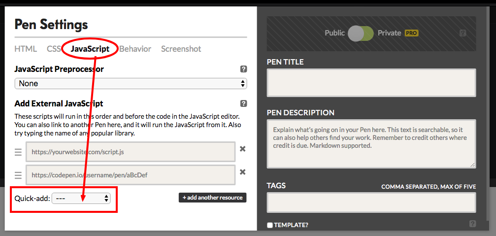

# Using jQuery for click-driven interactivity

Although you can use `onclick` for click-driven interactivity in JavaScript, the jQuery equivalent, `click()`, is well worth knowing. It's also a good entry point into learning jQuery as a whole.

**jQuery** is a JavaScript *library* - one of the most widely used libraries in the language. It includes a range of functions and methods for creating all sorts of interactivity, animation and cosmetic enhancement, such as fading or sliding things in and out.

The first thing we need to do with a a library is **import** it. The simplest way to do this is to link to a live version online, somewhere early on after your `<body>` tag:

`<script src="https://cdnjs.cloudflare.com/ajax/libs/jquery/3.2.1/jquery.min.js"></script>`

The link above is the version of jQuery hosted on [CDNJS](https://cdnjs.com/) - a content delivery network (CDN) for JavaScript. It is one of the fastest ways to load JS libraries.

Alternatively, you could link to a *copy* of the jQuery library hosted in the same place as your webpage. One reason you might want to do this is to test your code offline.

In code editors like Codepen you don't even need to add that line: when you create a new pen, you can go to the settings and under JavaScript use the *Quick-add* drop-down menu to select jQuery from the list of commonly used libraries.



This will also add a link to the CDNJS version. When you export the project, a line of code will be added that imports jQuery.

## A click in jQuery

Let's get stuck straight into some code that does something when clicked:

```js
$("h1").click(
  function() {
  $(this).slideUp()
})
```

I've spread this over multiple lines to make it easier to break up.

We begin with a dollar sign: `$`. This actually means `jQuery` - you can type that instead if you want, but `$` is much quicker to type. `$` is a *function*, which means it has to be followed by parentheses. Anything in those parentheses after `$` or `jQuery` is *selected* so it can then be manipulated by jQuery code.

`$("h1")`, then, *selects* all elements with a `<h1>` tag.

Next, `.click()` is added to the end of that. This creates an *event handler* that will specify what to do when those selected elements are clicked.

Within the parentheses of `click` are the lines of code to be executed when it is clicked. In this case, a *function* is to be executed. The function has no name - it is an anonymous function - and it does one thing: `$(this).slideUp()`

The dollar sign there is again selecting something: `(this)`, which here basically means whatever is being clicked.

The nice feature of `this` is that although there might be more than one element in a `h1` tag, the function will only affect the one being clicked.

And how will it affect it? By applying `.slideUp()` to that element.

We could write the code a different way, using `("h1")` instead of `(this)`. If we did that, however, the code would affect *all* elements in `h1` tags.

Note also that `"h1"` is in quotation marks - it's a *selector* - whereas `this` is not: it's a special *keyword*, like `var` or `if`, which has a particular meaning.

Now we need some HTML that's going to be affected by this JavaScript:

```html
<h1>Make me disappear</h1>
<h1>Make me disappear too</h1>
```


## Tasks

The function does not need to be defined *within* the `click()` method. Another way of writing the same code might look like this:

```js
var slideme = function() {$(this).slideUp()};
$("h1").click(
  slideme
             )
```

Here the function is defined in the first line, before being called within the `click` method. Try this with your own code.
